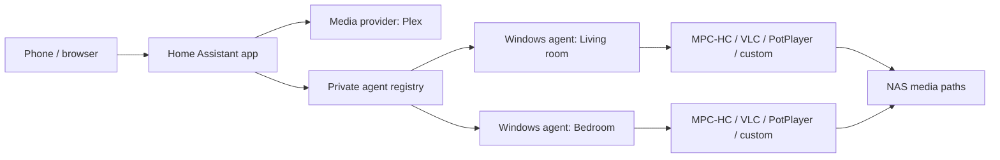

# Architecture

Media Launcher has a Home Assistant catalogue containing stable and beta apps plus independently
installed playback agents. The stable app currently represents the proven Plex/MPC-HC baseline;
the `1.8.0` beta introduces the multi-agent and multi-player foundation described here.

## Home Assistant app

The Node/Express process serves the static frontend and API from one port. `plex.js` is currently
the media-provider adapter. A selected Plex item is resolved to a server-side file path and then
translated with the selected agent's path mappings.

`agents.json` is a private registry containing agent URLs, one bearer secret per installation,
platform information, cached player capabilities, per-device path mappings, and bounded revocation
tombstones. Atomic writes keep a last-known-good backup. Browser-facing responses use deterministic
opaque references and never expose installation IDs, URLs, or secrets.

A playback target is the pair of an agent installation and one saved player profile. The frontend
fetches target availability before playback, opens the target picker when requested, and posts only
the opaque target ID. The backend resolves that ID and never falls back to a different room after
an explicit selection fails.

Playback monitors are keyed by target. Each status poll resolves the current authenticated agent
record again, so DHCP address refreshes do not strand an active monitor. Each monitor is bound to
the launched media path, reports progress to the active provider, marks watched near the configured
threshold, and keeps automatic next-episode playback on the same target. Launch-only players do not
create a monitor.

## Agent protocol

Protocol version 1 remains available for released stable apps and agents:

- `GET /health`
- `POST /pair`
- `POST /play`
- `GET /status`

New agents still register with `protocolVersion: 1` so old add-ons accept them, while advertising
`supportedProtocolVersions`. A beta add-on can select protocol version 2, which adds authenticated
capability discovery and session-aware playback:

- `GET /v2/info`
- `POST /v2/sessions`
- `GET /v2/sessions/{sessionId}`

String capability names allow players and future Linux agents to add features without changing the
transport contract. Player IDs are stable only inside an agent; the add-on combines the agent and
player identities into an opaque global target ID.

The agent persists a separate enrollment credential before its first registration. The add-on
adopts it for a new installation ID, making a lost first response idempotent; later registration
refreshes must authenticate with the established secret. Registrations refresh periodically so a
running agent can negotiate v2 after an add-on upgrade. Silent enrollment is rate-limited and
capped, and removing an installation creates a tombstone until its local identity is reset.

## Windows player agent

The .NET 8 WinForms application hosts the kiosk WebView2 window and Kestrel server. It detects known
players through registry entries, Windows App Paths, `PATH`, and standard installation locations.
MPC-HC has a dedicated adapter and status reader. VLC and PotPlayer use safe built-in launch
profiles in this beta.

The session manager owns the launched process, enforces one active local session, stops the old
process before replacement, and restores the kiosk only when the current owned process exits.

Custom profiles are stored locally and contain an absolute executable, optional working directory,
and one argument template per token. The agent expands `{media_path}`, `{title}`, and
`{start_seconds}`, uses `ProcessStartInfo.ArgumentList`, and never invokes a shell. The media path is
validated against locally configured UNC roots; titles and resume positions are untrusted metadata
kept inside individual argument boundaries.

## Future provider and Linux boundary

Jellyfin belongs behind the same media-provider contract as Plex; it must not leak provider DTOs
into playback targets or player adapters. Linux will be a separate host executable sharing the
protocol and player contracts, with platform-specific path validation, discovery, desktop-session
integration, and mpv/MPRIS adapters.
