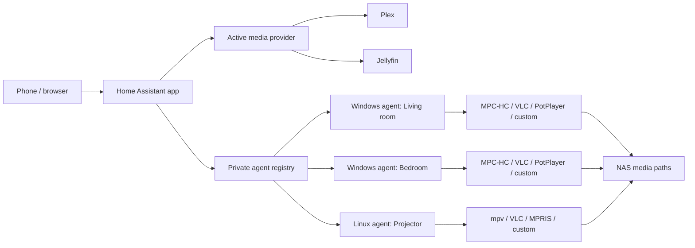

# Architecture

Media Launcher has a Home Assistant catalogue containing stable and beta apps plus independently
installed playback agents. Stable remains the proven Plex baseline. Beta `2.0.0` includes the
provider boundary and Jellyfin, shared Windows/Linux agent contracts, rich player controls, Linux
packaging, and guarded cross-platform release automation.

## Home Assistant app

The Node/Express process serves the static frontend and API from one port. `provider-manager.js`
creates a request-scoped immutable Plex or Jellyfin provider from private configuration. Both
providers normalize libraries and items into the same public model. The browser sees opaque item
IDs and provider-qualified artwork references, never provider tokens or source file paths.

Browse routes live under `/api/media`. `/api/bootstrap` exposes only provider readiness and whether
any playback targets exist, so normal startup never fetches PIN-protected Settings. Legacy
Plex-shaped routes remain temporarily for cached beta clients, but the current frontend no longer
uses them; they return a conflict response while Jellyfin is active so cached clients cannot mix
Plex item IDs with Jellyfin playback.

On Play, the active provider returns a private playback descriptor containing the canonical item,
direct source path, resume position, and provider session context. The path is translated with the
selected agent's mappings and sent only to that agent. A monitor captures the exact immutable
provider instance and descriptor; changing the active provider cannot redirect progress or
automatic next-episode work from an already-running session. Unlinking an account cancels every
monitor holding a snapshot for that provider before it can perform later progress or auto-next work.

`agents.json` is a private registry containing agent URLs, one bearer secret per installation,
platform information, cached player capabilities, per-device path mappings, and bounded revocation
tombstones. Atomic writes keep a last-known-good backup. Browser-facing responses use deterministic
opaque references and never expose installation IDs, URLs, or secrets.

A playback target is the pair of an agent installation and one saved player profile. The frontend
fetches target availability before playback, opens the target picker when requested, and posts only
the opaque target ID. The backend resolves that ID and never falls back to a different room after
an explicit selection fails.

Playback monitors are keyed by physical agent, with the selected player target retained inside the
session. Launching another player on the same device replaces its previous monitor, while separate
devices remain independent. Each status poll resolves the current authenticated agent
record again, so DHCP address refreshes do not strand an active monitor. Each monitor is bound to
the launched media path, reports progress to its captured provider, marks watched near the
configured threshold, and keeps automatic next-episode playback on the same player target. Launch-only
players do not create a monitor.

## Media-provider contract

Plex and Jellyfin implement the same library, item, artwork, playback, watched, progress, and scan
operations. Provider DTOs are converted at the boundary; frontend code renders only the canonical
model. Ratings use a 0–100 scale, time uses milliseconds, and hierarchy fields identify series,
season, and episode relationships consistently.

Jellyfin login verifies an anonymous server identity and minimum version before sending a password,
then persists only a server-scoped user token. Direct-file playback context includes Jellyfin's
media-source and play-session IDs; those fields remain backend-only. Jellyfin offers only a global
library refresh, so its provider validates the selected library but invokes the global operation.

Artwork references encode a provider-owned relative path. Each provider decodes and revalidates
its own paths, rejects redirects, and sends credentials in headers only. The HTTP proxy accepts
only a raster-image allowlist, caps artwork at 25 MiB and 30 seconds, and copies only a small
allowlist of safe cache headers.

## Agent protocol

Protocol version 1 remains available for released stable apps and agents:

- `GET /health`
- `POST /pair`
- `POST /play`
- `GET /status`

New agents still register with `protocolVersion: 1` so old add-ons accept them, while advertising
`supportedProtocolVersions`. A beta add-on can select protocol version 2, which adds authenticated
capability discovery and session-aware playback:

- `GET /v2/info`
- `POST /v2/sessions`
- `GET /v2/sessions/{sessionId}`
- `POST /v2/sessions/{sessionId}/control`

The unified control body uses `pause`, `resume`, `seek`, or `stop`; seek positions are integer
milliseconds. The add-on resolves the opaque target again for every command and forwards only when
protocol v2 and the matching `control.pause`, `control.seek`, or `control.stop` capability are
present. String capability names let platform-specific adapters remain additive. Player IDs are
stable only inside an agent; the add-on combines the agent and player identities into an opaque
global target ID.

The agent persists a separate enrollment credential before its first registration. The add-on
adopts it for a new installation ID, making a lost first response idempotent; later registration
refreshes must authenticate with the established secret. Registrations refresh periodically so a
running agent can negotiate v2 after an add-on upgrade. Silent enrollment is rate-limited and
capped, and removing an installation creates a tombstone until its local identity is reset.

## Windows player agent

The .NET 8 WinForms application hosts the kiosk WebView2 window and Kestrel server. It detects known
players through registry entries, Windows App Paths, `PATH`, and standard installation locations.
MPC-HC has a dedicated adapter and status reader. VLC gets a random password and numeric
loopback-only HTTP endpoint per owned session, providing status, pause/resume, seek, and graceful
stop without exposing VLC control to the LAN. PotPlayer has no documented reliable authenticated
status mechanism, so it advertises only launch and owned-process stop.

The session manager owns the launched process, enforces one active local session, stops the old
process before replacement, and restores the kiosk only when the current owned process exits.

Custom profiles are stored locally and contain an absolute executable, optional working directory,
and one argument template per token. The agent expands `{media_path}`, `{title}`, and
`{start_seconds}`, uses `ProcessStartInfo.ArgumentList`, and never invokes a shell. The media path is
validated against locally configured UNC roots; titles and resume positions are untrusted metadata
kept inside individual argument boundaries.

## Shared core and Linux player agent

`agent-core` contains the protocol DTOs, bearer comparison, capability vocabulary, player adapter
contracts, bounded request cache, and Windows/Linux path policy. Both executables reference it, so
wire names and security checks cannot evolve as unrelated copies.

The Linux executable runs in the logged-in desktop user's session under a hardened systemd user
unit. It discovers native executables, known `.desktop` entries, Flatpak and Snap profiles, plus
locally configured tokenized commands without invoking a shell. Native mpv uses a private Unix
socket and JSON IPC. VLC and generic controlled profiles use MPRIS through `playerctl`; when a
reliable control surface is unavailable the descriptor is honestly launch-only. The service makes
standard per-user XDG and common Flatpak/Snap state directories writable for child players while
keeping the rest of home read-only; actual Flatpak/Snap launch behavior remains distro-specific and
requires real-device acceptance.

Linux paths must be existing absolute files below configured roots. Every symlink component is
resolved before the boundary comparison. The add-on retains one path-map set per agent and emits
Windows UNC or Linux slash-separated destinations according to the registered platform.

## Release boundary

Protocol examples under `protocol/fixtures` are exercised by the add-on and agent contract harnesses
so additive v1/v2 changes cannot drift independently. CI publishes the Windows x64, Linux x64, and
Linux arm64 agents with release settings and rejects outputs that are not single self-contained
executables with the expected PE/ELF architecture and embedded runtime/version markers.

The prerelease workflow derives every tag and asset name from checked-in version metadata, refuses
an existing tag, emits SHA-256 checksums, and attaches a fail-closed acceptance record. Stable is
never copied by hand: `scripts/promote-beta-to-stable.js` rebuilds it deterministically from the beta
tree while restoring the stable catalogue identity and port. Its writing mode requires a clean
`main`, an explicit confirmation phrase, an accepted beta commit whose `addon-beta` tree is still
identical, and passed Home Assistant, Windows, and Linux checks.
