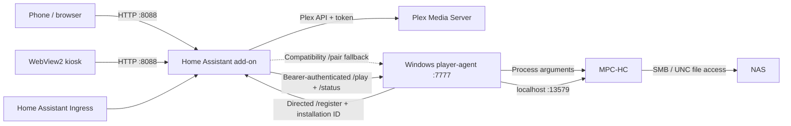

# Architecture

Media Launcher has two deployable components and uses Plex only for metadata and watch state.
MPC-HC reads the media file directly from its Windows-accessible UNC path.

## Home Assistant add-on

The Node/Express process serves the static frontend and API from one port. `plex.js` is the Plex
adapter, `pathmap.js` translates Plex paths into approved Windows paths, and
`playback-monitor.js` owns the single active playback session. Persistent data lives in `/data` in
Home Assistant and `addon/app/local-data` during local development.

Settings and Plex linking require the optional admin PIN once configured. Normal library browsing,
household controls, and component registration remain open by design. The Plex token and player
secret are never returned to the browser.

## Windows player-agent

The .NET 8 WinForms application hosts both WebView2 and a small Kestrel server. The server validates
the bearer secret and media path before `MpcLauncher` starts MPC-HC. MPC status is read only from
MPC-HC's localhost Web Interface. Configuration and logs live under the current user's LocalAppData.

On first setup, the agent posts its protocol, listening port, and persistent random installation ID
to `/api/player-agent/register` at the one add-on URL configured by the user. The add-on derives the
agent host from the connection source, generates the shared key, and binds it to that installation.
It accepts refresh/recovery from the same installation and rejects a different one. The original
add-on-initiated `/pair` endpoint remains as a compatibility fallback.

## Playback sequence

1. The browser posts a Plex rating key to the add-on.
2. The add-on obtains the media file from Plex metadata and applies a boundary-safe path mapping.
3. The add-on sends the UNC path and bearer secret to the player.
4. The player validates the secret, UNC root, and extension, then starts MPC-HC.
5. One monitor session polls status, reports progress, marks watched near the threshold, and only
   advances after a near-end transition to stopped.
